# bidnamic-devops-challenge

> Bidnamic's DevOps Coding Challenge for DevOps Engineer Job Role.  
> Live demo hosted [_here_](https://bidnamic.tobisolomon.me/). 

## Technologies and Services Used

1. Terraform - Used to provision the following resources on AWS:
    - VPC with specified CIDR, private and public subnet. NAT gateway enabled
    - EKS Cluster in private subnet, Node groups with scaling, IAM Roles for Cluster and Node groups
    - AWS ECR to host the Docker container images
    - Install Helm and AWS ALB Ingress Controller into the cluster
    - Ingress Controller of type 'alb' mapped to SubDomain Name - bidnamic.tobisolomon.me with publicly signed SSL Certificate

2. AWS Cloud provider
   Subservices:
   - EKS - EC2 Type 
   - VPC - Route Tables, Subnets, SG
   - AWS ALB
   - Route53
   - Certificate Manager
   - IAM
   - CloudWatch

3. Docker - package and containerise Flask app in AWS EKS - EC2 type with less priviledged user (Dockerfile).

4. Helm - package manager for deploying the Flask app in EKS. Helm .yaml files for the Flask app located in /charts.

5. Git Actions - CI/CD tool for building and deploying Docker image and Flask app into AWS ECR, EKS clsuter. Install Flask app Helm manifest into the AWS EKS Cluster and manage Secrets in Git Secrets.

## Installation
### Prerequisites 
You need to have the following installed on your local machine -

1. Terraform
2. Helm
3. AWS CLI
5. KubeCtl
6. Shell 

The following are required also -

1. AWS Account
2. Programmatic IAM User for Github Authentication
 

### Steps
1. Fork [_repository_](https://github.com/kryfnut/bidnamic-devops-challenge.git) to your own repository
    
2. Login to your AWS Console. Navigate to IAM and create a new Programmatic Access User with 'AdministrativeAccess' Policy binding. Download CSV with IAM user details.

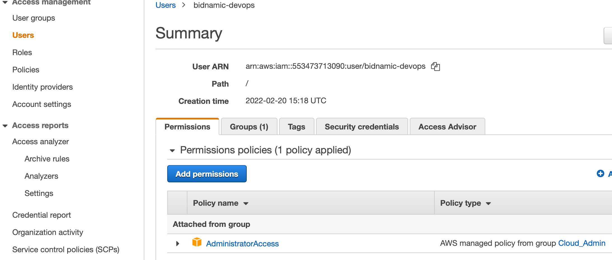

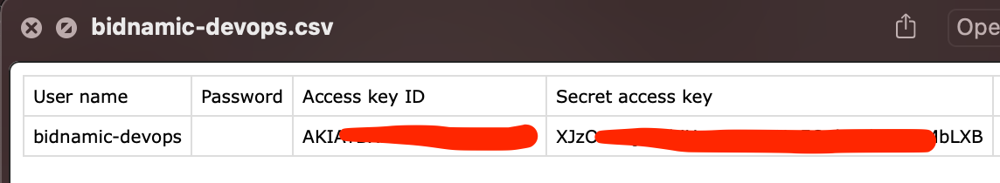
    
3. Go to repository settings > secrets > actions secret :
         Add 'New Repository Secret' for each of the following secrets :

            - Enter key as 'AWS_ACCESS_KEY_ID' and set to IAM User access_key_id value you created for GitHub Authentication. 
            - Enter key as 'AWS_SECRET_ACCESS_KEY' and set to same IAM User secret_access_key value created for GitHub Authentication.

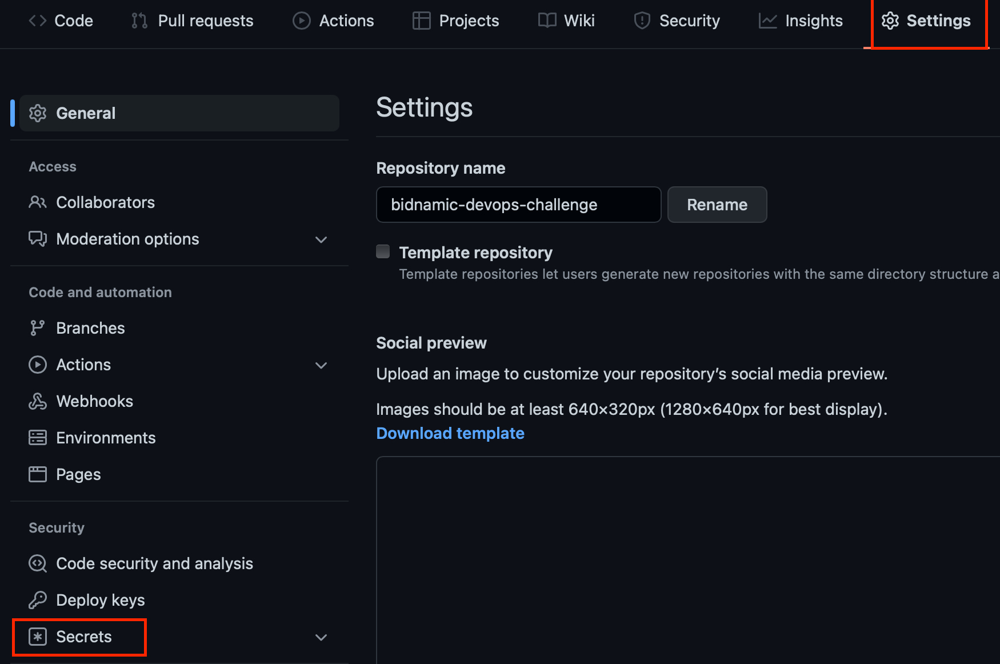

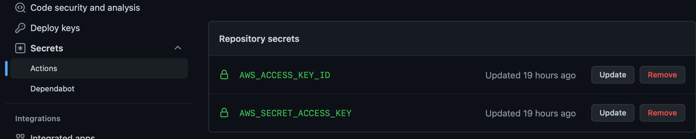

4. Open Terminal and run 

        'aws configure --profile name-you-wish-to-use'
    
    - Input the AWS credentials of your IAM User and set the region to where you AWS environment would be hosted ---->  eu-west-2 in this case.
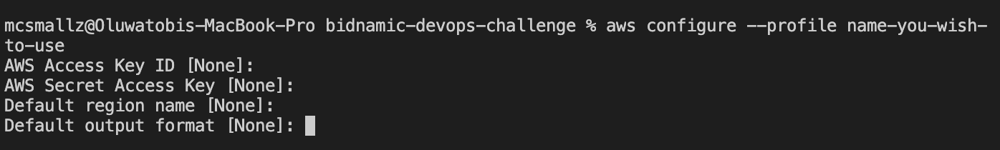
    
5. Navigate into /iac folder - 'cd iac/' and follow below steps -

    A. Edit the following in ingress.tf file -
    
        data "aws_route53_zone" "tobisolomon_me" {
        name = "tobisolomon.me"         // change to your DN hosted on Route53
        }

        data "aws_acm_certificate" "tobisolomon_me" {
        domain   = "tobisolomon.me"     // change to your DN hosted on Route53 w/SSL Cert
        statuses = ["ISSUED"]
        }                

    Then save the file and exit.

    B. Edit the following in provider-backend.tf file -

        backend "s3" {
            bucket  = "iac-tobi-solomon"    //your S3 bucket name 
            key     = "bidnamic/"           //path in the bucket
            region  = "eu-west-2"           //region where bucket resides in AWS
            profile = "tobi"                //AWS CLI/Configure profile 
            encrypt = true
          }
        }

    C.  Run the following commands to process Terraform files

        - terraform init        #to install all dependencies and required providers
        - terraform plan        #to see a list/summary of all resources to be provisioned
        - terraform apply       #to install the resources as detailed in 'plan' to AWS

6. Once terraform installation is complete, trigger (push/pull to master) the Git Actions workflow to deploy the Flask App within your EKS Cluster and expose it via https://bidnamic.your_domain_name/

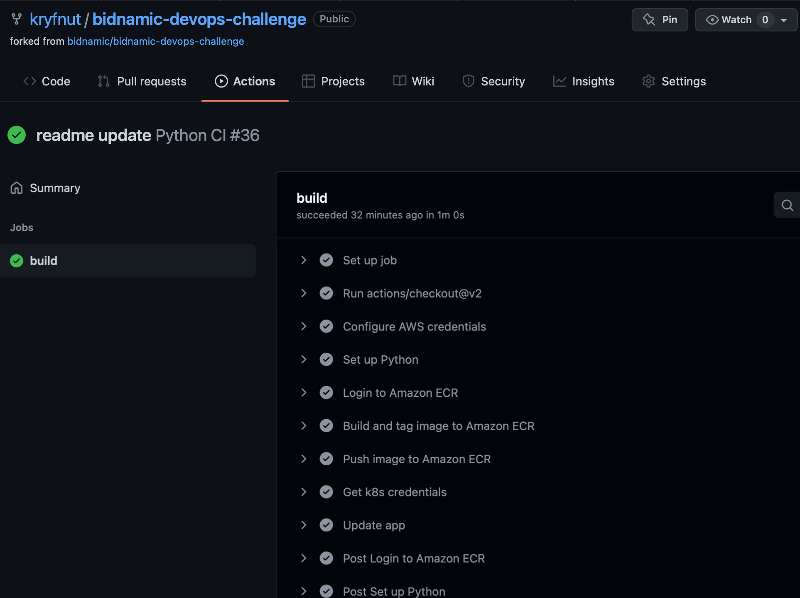

### Monitoring
    
1. Install CloudWatch Agent and FluentBit into EKS Cluster to collect logs and metrics and send to CloudWatch Dashboard for Monitoring and Troubleshooting. See guide on how to install here - https://docs.aws.amazon.com/AmazonCloudWatch/latest/monitoring/deploy-container-insights-EKS.html

2. Open CloudWatch Dashboard to visualise statistics being collected and view log groups from the cluster.
    - CloudWatch > Logs > Log Groups
    
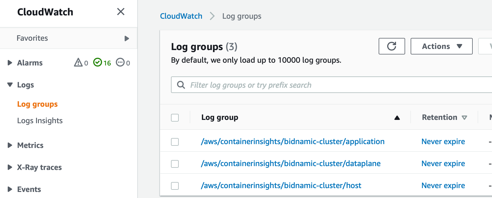

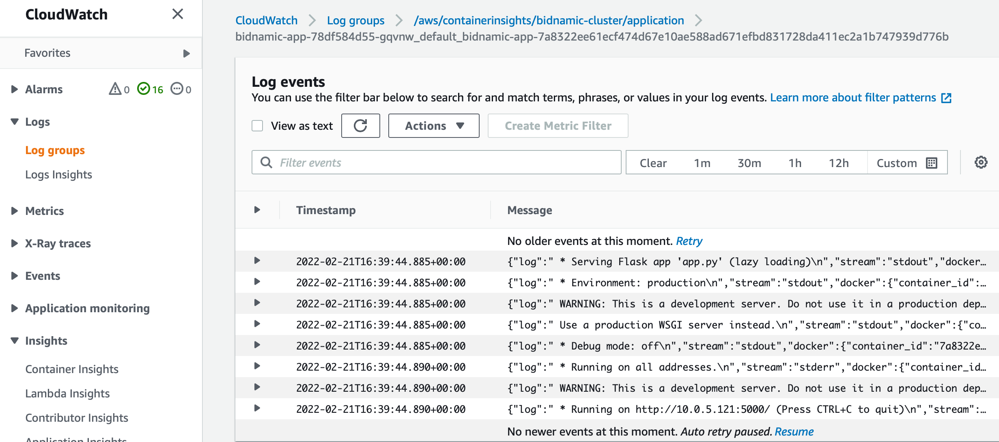

    - CloudWatch > Insights > Container Insights

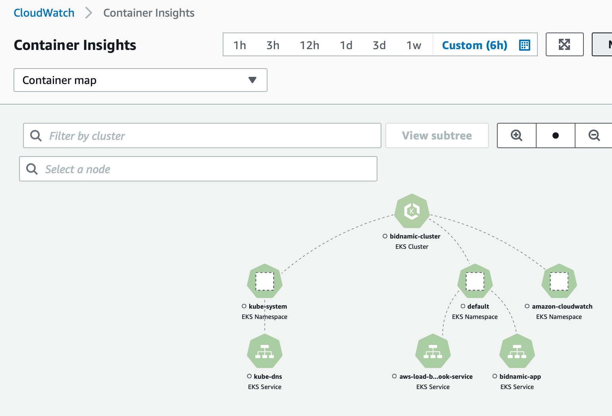

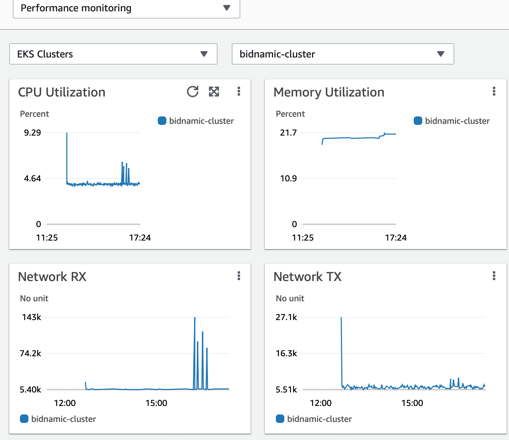

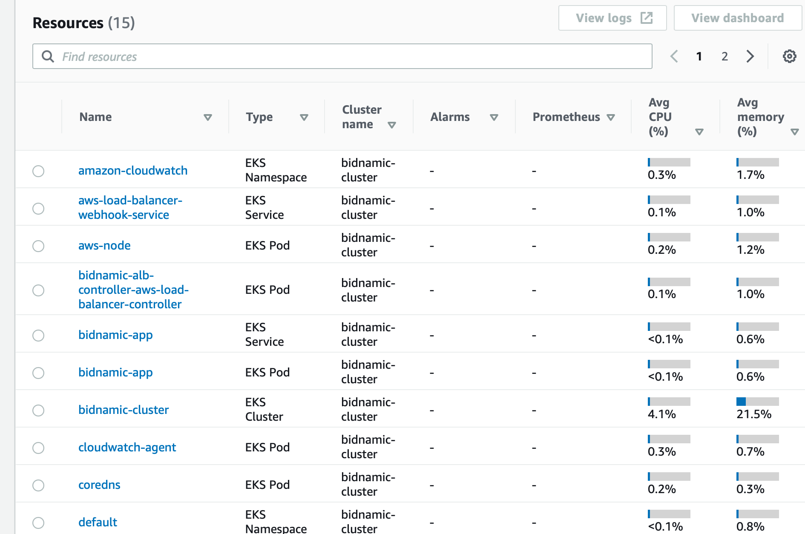

## Troubleshooting

        terraform show                          
#To list all the AWS resources installed and managed by Terraform

        kubectl get pods                         
#To get pods in default namespace which should include bidnamic-app and bidnamic-alb-controller

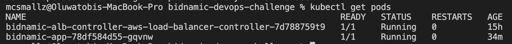

        kubectl get pods -n amazon-cloudwatch    
#To ensure the cloudwatch agent and fluentbit deployed successfully

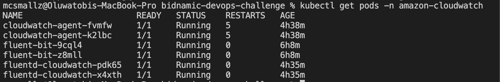

## Areas for Improvement
- Subscribe to SNS for Notifications on failed Alarms for proactive monitoring
- Integrate with API Gateway
- Scan Docker Images on Push to ECR